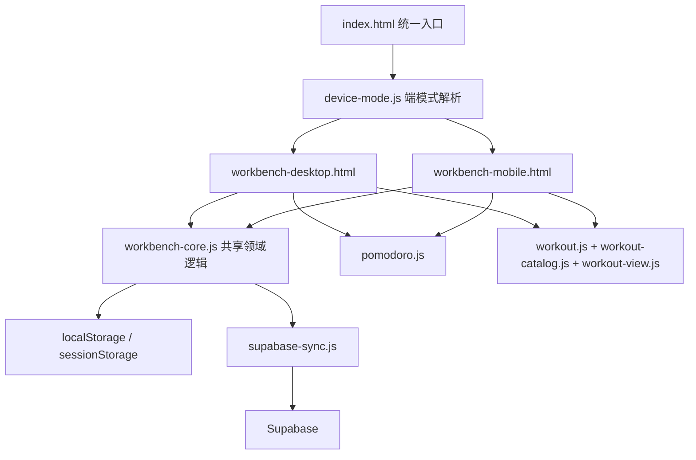
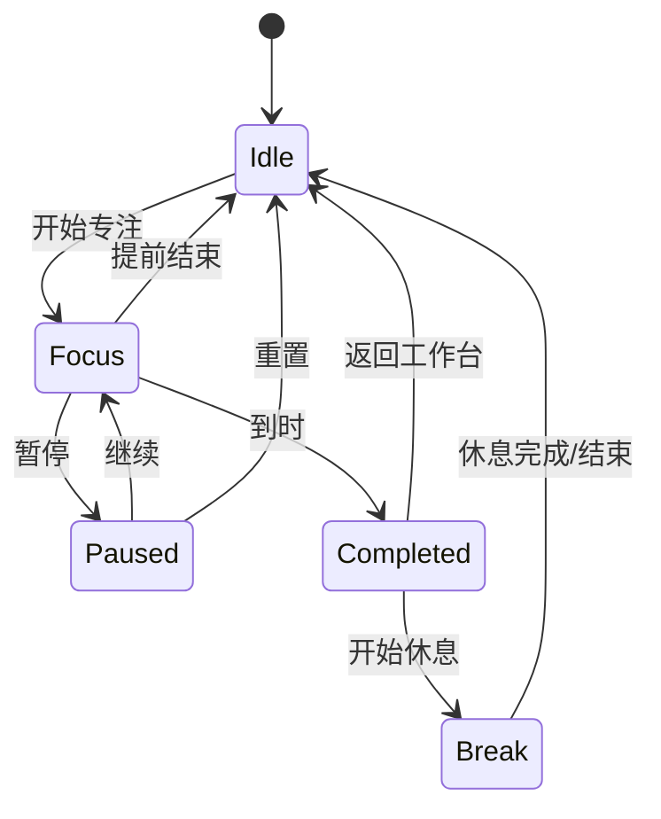

# 猫咪生活报 V3 实施设计文档

> 状态：已实施并完成本地验收  
> 基线：`main@02d7702`  
> 实施日期：`2026-08-31`  
> 范围：端适配、番茄钟专注模式、运动训练快捷记录、同步可靠性与共享代码治理

## 1. 背景与目标

当前项目由两个独立入口组成：

- `workbench-desktop.html`：桌面布局和完整业务逻辑。
- `workbench-mobile.html`：移动布局和另一套完整业务逻辑。
- `supabase-sync.js`：两端共用的认证、存储同步和 AI 周报客户端。

两端已经使用同一个 `localStorage` 数据键 `cat-newsroom-data-v2`，同源浏览器内的数据天然共享；登录正式账号后，不同设备通过 Supabase 共享数据。当前缺少统一入口、设备模式偏好、完整的番茄钟专注体验，以及适合力量训练的结构化记录方式。

本次目标：

1. 自动选择桌面版或移动版，并允许用户手动切换和记住选择。
2. 番茄钟启动后进入全页面专注模式，计时在切换标签页或锁屏后仍准确。
3. 将运动模块升级为按训练日选择动作、快速录入组数/次数/重量的训练日志。
4. 建立“初始化/手动全量，其余单项原子同步”的同步边界，并修复已发现的可靠性问题。
5. 逐步抽取两端共享逻辑，避免同一功能重复维护。

## 2. 范围边界

### 2.1 本期包含

- 新增统一入口 `index.html`。
- 自动端判断及 `自动 / 桌面 / 移动` 三态偏好。
- 两端均可手动切换，并保留当前业务页面。
- 全页面番茄钟专注模式、暂停、继续、结束、重置和休息阶段。
- 番茄钟运行态本地持久化和时间校准。
- 训练日、预置动作、训练组、重量、次数、RPE 和备注。
- 根据训练日推荐动作；手臂小肌群动作可在任意训练日添加。
- 旧运动进度数据兼容展示。
- 删除同步、空模块合并、周报错误轮询、移动端元数据同步修复。
- 页面初始化或手动同步之外，所有数据变化均使用单项原子同步。
- 核心纯函数和关键浏览器流程测试。

### 2.2 本期不包含

- 社交、排行榜、训练计划自动排期。
- AI 自动生成训练计划或医学建议。
- 视频动作教学和姿态识别。
- 公斤/磅自动换算；首版统一使用 `kg`。
- 将端模式偏好同步到云端。该偏好只属于当前浏览器。
- 一次性重写为 React/Vue；采用渐进式共享模块改造。

## 3. 需求矩阵

| 编号 | 需求 | 验收标准 | 影响范围 | 状态 |
| --- | --- | --- | --- | --- |
| REQ-001 | 自动识别合适布局 | 首次访问统一入口时，根据视口和输入能力进入正确页面 | 新入口、两端页面 | 已实现 |
| REQ-002 | 手动切换布局并记忆 | 用户可选择自动、桌面或移动；刷新和再次访问仍生效 | 顶栏/侧栏、本地存储 | 已实现 |
| REQ-003 | 切换端时保持数据和上下文 | 同源数据不复制；切换后仍停留在原业务模块 | 路由、localStorage、sessionStorage | 已实现 |
| REQ-004 | 全页面番茄钟专注模式 | 开始后只展示专注界面和必要控制，结束后回到原页面 | 首页、全局浮层 | 已实现 |
| REQ-005 | 番茄钟运行可靠 | 后台、锁屏、刷新后剩余时间按绝对时间恢复 | 本地状态、计时器 | 已实现 |
| REQ-006 | 按训练日快速选动作 | 选择胸/背/肩/腿等训练日后展示对应动作 | 运动模块 | 已实现 |
| REQ-007 | 记录重量训练详情 | 每个动作可记录组数、次数、重量、RPE 和完成状态 | 运动数据模型、编辑器 | 已实现 |
| REQ-008 | 通用小肌群动作 | 二头弯举、锤式弯举、绳索下压等可用于任意训练日 | 动作库、筛选逻辑 | 已实现 |
| REQ-009 | 旧运动记录兼容 | 现有 `current/target/unit` 数据不丢失且仍可查看编辑 | 数据归一化、运动页面 | 已实现（兼容展示） |
| REQ-010 | 同步可靠性修复 | 云端删除不会复活；失败删除可重试；远端空模块可正确同步 | `supabase-sync.js` | 已实现 |
| REQ-011 | 周报错误可恢复 | 生成失败不会无限轮询，用户可明确重试 | Edge Function、两端周报 UI | 已实现 |
| REQ-012 | 两端行为一致 | 端模式、番茄钟、运动和同步的核心逻辑只维护一份 | 共享脚本、两端适配层 | 已实现 |
| REQ-013 | 严格限制全量同步 | 只在页面重新进入后的首次初始化或用户手动同步时执行全量同步；其他变化均为单项原子同步 | `supabase-sync.js`、Realtime、两端保存入口 | 已实现 |
| REQ-014 | 训练补录与日期修改 | 新建和编辑训练时均可选择训练日期，历史记录按日期倒序 | 训练编辑器、数据模型 | 已实现 |
| REQ-015 | 训练历史详情和编辑 | 历史卡可查看动作/组次详情，并原地修改完整 Session | 训练历史、详情弹窗 | 已实现 |
| REQ-016 | H5 训练操作优化 | 快捷动作通过弹窗整项点击添加，元数据和底部保存栏在窄屏正确对齐 | 训练 UI、响应式样式 | 已实现 |

## 4. 总体架构



建议新增文件：

```text
index.html
js/
  device-mode.js          # 端模式判断、偏好和跳转
  workbench-core.js        # 存储、日期、记录归一化等共享逻辑
  pomodoro.js              # 番茄钟状态机和时间计算
  workout-catalog.js       # 训练日和动作静态目录
  workout.js               # 训练记录模型、统计和快捷填充
  workout-view.js          # 训练编辑器、历史卡片和详情视图
css/
  workout-ui.css           # 两端共享的训练响应式样式
tests/
  device-mode.test.js
  pomodoro.test.js
  workout.test.js
  sync-merge.test.js
```

首版保留两个 HTML 页面，只把核心逻辑抽出；页面分别负责布局和 DOM 绑定。

## 5. 端适配与手动切换

### 5.1 模式优先级

本地键：

```text
cat-newsroom-ui-mode-v1 = auto | desktop | mobile
cat-newsroom-last-view-v1 = home | insight | todo | checkin | read | sport | money | note | hot
```

解析顺序：

1. 已保存为 `desktop` 或 `mobile`：始终使用用户选择。
2. 保存为 `auto` 或没有记录：运行自动判断。
3. 自动判断以 CSS Media Query 为主，不读取 User-Agent。

建议判断规则：

```js
// 小屏设备直接使用移动布局；触控平板结合宽度判断。
const isMobileViewport = matchMedia("(max-width: 820px)").matches;
const isCompactTouch = matchMedia("(pointer: coarse)").matches && innerWidth <= 1024;
const resolvedMode = isMobileViewport || isCompactTouch ? "mobile" : "desktop";
```

只在页面首次加载和用户选择“自动”时解析，不在普通窗口缩放时强制跳转，避免编辑过程中突然刷新页面。

### 5.2 统一入口

- GitHub Pages 默认访问 `index.html`。
- `index.html` 只负责解析模式并使用 `location.replace()` 导航。
- 两个现有页面也加载 `device-mode.js`，支持用户直接访问旧链接时纠正布局。
- 目标页面与当前页面相同时不跳转，防止循环。

### 5.3 手动切换控件

- 桌面版：侧栏底部同步区上方放置显示器/手机图标按钮，点击打开三项菜单。
- 移动版：抽屉设置区放置同样的三态选项。
- 当前解析结果和偏好分开展示，例如“自动（当前：移动版）”。
- 选择后立即保存偏好，再保存当前 `view`，最后进入目标页面。
- 切换后目标页读取 `cat-newsroom-last-view-v1` 并恢复对应模块。

### 5.4 数据互通说明

- 同一域名、协议和端口：两个页面读取同一个 `cat-newsroom-data-v2`，无需迁移或复制。
- 不同浏览器或不同物理设备：必须登录同一正式账号，由 Supabase 同步。
- 本地文件、GitHub Pages 和开发服务器属于不同 Origin，彼此不能共享 localStorage，这是浏览器安全边界。

## 6. 番茄钟专注模式

### 6.1 交互流程



点击“开始”后创建覆盖整个视口的专注层：

- 中央显示大号剩余时间、当前阶段和环形进度。
- 可选选择一条“今日聚焦”任务作为本轮目标。
- 仅保留暂停/继续、提前结束和退出专注模式三个控制。
- 隐藏侧栏、底部导航、滑动切页和业务内容，阻止背景滚动。
- 更新浏览器标题为 `24:35 · 专注中`。
- 支持 `Esc` 提示退出；移动端返回手势不直接丢失计时。
- 可选请求 Fullscreen API，但拒绝授权时仍使用全视口专注层。

### 6.2 状态模型

本地键：`cat-newsroom-pomodoro-runtime-v1`。

```js
{
  version: 1,
  phase: "focus",          // focus | break
  status: "running",      // running | paused
  durationSec: 1500,
  startedAt: 1788105600000,
  endsAt: 1788107100000,
  pausedRemainSec: null,
  focusRecord: { moduleKey: "todo", recordId: "12", title: "整理纪要" }
}
```

计时必须以 `endsAt - Date.now()` 计算，`setInterval` 只负责刷新画面，不能再通过每秒执行 `remain--` 作为真实时间源。

### 6.3 恢复与完成

- 刷新后若 `status=running` 且未到时，自动恢复专注层。
- 若已到时，执行一次幂等完成逻辑并清空运行态。
- 暂停时保存 `pausedRemainSec`；继续时重新计算 `endsAt`。
- 完成专注阶段后累计 `__pomo.count` 和 `__pomo.min`，提前结束不累计完整番茄。
- 增加 `completedSessionIds` 或完成时间戳保护，避免多标签页重复计数。
- 使用 `storage` 事件同步同源标签页中的运行状态。
- `__pomo` 继续通过 `workbench_meta.pomo_stats` 云端同步；运行中的倒计时只保存在本机。

## 7. 运动健身模块

### 7.1 设计原则

当前 `sport` 使用通用 `progress` 类型，只能表达“当前/目标/单位”。V3 将一条新运动记录定义为一次训练 Session，Session 内包含多个动作和多组数据。这样更符合“今天练胸，一次加入多个动作”的实际操作。

### 7.2 数据模型

新记录使用 `schema_version: 2`，仍存放在 `data.sport` 和 `workbench_records`，无需新增数据库表。

```js
{
  id: "workout-1788105600000",
  schema_version: 2,
  kind: "workout_session",
  title: "胸日",
  training_day: "chest",
  date: "2026-08-31",
  duration_min: 65,
  exercises: [
    {
      id: "set-group-1",
      exercise_id: "dumbbell_bench_press",
      name: "哑铃卧推",
      body_part: "chest",
      equipment: "dumbbell",
      angle: "flat",
      sets: [
        { weight_kg: 24, reps: 10, rpe: 8, completed: true },
        { weight_kg: 24, reps: 9, rpe: 9, completed: true }
      ],
      note: "肩胛保持稳定"
    }
  ],
  note: "",
  updated_at: "2026-08-31T10:00:00.000Z"
}
```

派生指标：

- 总组数：所有 `completed` 组数量。
- 总次数：完成组的 `reps` 合计。
- 训练容量：`weight_kg × reps` 合计，不额外乘组数，因为每组单独存储。
- 动作最佳重量：同一 `exercise_id` 历史完成组的最大重量。
- 上次参数：最近一次同动作的最后完成组，用于快捷填充。

### 7.3 训练日

| 标识 | 展示名 | 主训练范围 |
| --- | --- | --- |
| `chest` | 胸日 | 胸大肌、前三角、肱三头 |
| `back` | 背日 | 背阔肌、中背、后束、肱二头 |
| `shoulders` | 肩日 | 前束、中束、后束 |
| `legs` | 腿日 | 股四头、腘绳肌、臀、腓肠肌 |
| `arms` | 手臂日 | 肱二头、肱三头、前臂 |
| `full_body` | 全身日 | 深蹲、推、拉复合动作 |
| `cardio` | 有氧/恢复 | 跑步、单车、划船、拉伸 |

### 7.4 首版预置动作库

胸日：

- 哑铃卧推（水平、上斜）
- 推胸机（水平、上斜、下斜）
- 杠铃卧推（水平、上斜）
- 双杠臂屈伸
- 绳索夹胸（高位、中位、低位）
- 蝴蝶机夹胸

背日：

- 引体向上
- 高位下拉（宽握、窄握）
- 杠铃划船
- 坐姿绳索划船
- 单臂哑铃划船
- 器械划船
- 直臂下压

肩日：

- 实力推（Strict Press）
- 哑铃肩推
- 器械推肩
- 哑铃侧平举
- 绳索侧平举
- 反向蝴蝶机
- 面拉

腿日：

- 杠铃深蹲
- 哈克深蹲
- 腿举
- 罗马尼亚硬拉
- 腿屈伸
- 腿弯举
- 臀推
- 站姿/坐姿提踵

任意训练日可添加的小肌群动作：

- 哑铃弯举
- 锤式弯举
- 杠铃弯举
- 牧师凳弯举
- 绳索弯举
- 绳索下压
- 直杆下压
- 过顶臂屈伸
- 仰卧臂屈伸

有氧/恢复：

- 跑步机、户外跑、动感单车、椭圆机、划船机、登阶机
- 动态热身、静态拉伸、泡沫轴

动作目录为静态配置，每项包含：

```js
{
  id: "machine_chest_press_incline",
  name: "推胸机（上斜）",
  trainingDays: ["chest", "full_body"],
  bodyPart: "chest",
  equipment: "machine",
  angle: "incline",
  availableOnAllDays: false
}
```

### 7.5 快捷操作流程

1. 进入运动模块，默认选中上次使用的训练日；没有历史时显示训练日选择。
2. 点击“开始训练”，创建当天草稿 Session。
3. 页面顶部使用分段控件切换训练日。
4. 首屏展示“推荐动作”和“任意日小肌群”，每个动作右侧提供加号按钮。
5. 点击动作后立即加入当前 Session，并自动带出上次重量、次数和默认 3 组。
6. 动作卡支持：完成本组、加一组、复制上一组、删除组、调整重量和次数。
7. 重量使用步进器，默认步长 `2.5kg`，同时允许键盘输入；次数默认步长 1。
8. 点击“完成训练”填写总时长和备注，保存为正式记录。
9. 未完成草稿保存在本地，刷新后可继续；草稿不参与周报和统计。

移动端采用底部抽屉编辑组数，固定底部显示“完成训练”；桌面版采用左侧动作库、右侧当前训练的双栏布局。

### 7.6 旧数据兼容

旧记录满足 `current/target/unit` 且没有 `exercises` 时，归类为 `legacy_progress`：

- 不自动改写、不删除、不上传新结构。
- 在运动历史中显示“旧版目标”标签。
- 仍可使用原编辑器修改。
- 新增记录全部使用 V3 Session 模型。
- 周报快照同时识别旧进度和新训练 Session。

## 8. 同步与周报修复

### 8.1 同步边界与原子契约

同步分为两类，调用方不得混用：

| 类型 | 允许触发时机 | 行为 |
| --- | --- | --- |
| 全量同步 | 页面重新进入后的首次初始化 | 拉取当前账号的全部 records/meta，归一化后一次合并到本地 |
| 全量同步 | 用户点击“立即同步” | 先处理本地 outbox，再全量拉取并执行冲突合并 |
| 原子同步 | 新增或编辑一条普通记录 | 只 upsert 对应 `user_id + id` 的一行 |
| 原子同步 | 删除一条普通记录 | 只 upsert 对应记录的 tombstone，不扫描其他记录 |
| 原子同步 | 完成一次训练 Session | 整个 Session 作为一条 JSONB 记录，只 upsert 该行 |
| 原子同步 | 头像、番茄统计或趋势变化 | 只更新 `workbench_meta` 对应字段，不提交无关字段 |
| 原子同步 | Realtime 收到远端变化 | 只将事件中的 INSERT/UPDATE/DELETE 应用到对应本地实体 |

硬性约束：

- 普通 `persist()` 只保存本地，并把明确的实体变更交给 `syncRecord(record)`、`syncDelete(tombstone)` 或 `syncMetaField(key, value)`。
- 页面内普通保存不得调用 `scanDirtyRecords()`、`pushAllLocalToCloud()` 或全表 `select`。
- Realtime 回调不得调用 `loadFromCloud()`；必须使用事件的 `new`/`old` 数据原子更新本地对应记录。
- `pushAllLocalToCloud()` 更名为语义明确的 `runFullSync(reason)`，并校验 `reason` 只能是 `page_init` 或 `manual`。
- 自动重试只重放失败的 outbox 单项操作，不允许降级成全量扫描或全量覆盖。
- 同一实体的原子操作携带 `operation_id`、`updated_at` 和实体键，重复提交必须幂等。
- 全量同步同一页面生命周期只允许自动执行一次；只有用户手动同步可以在当前生命周期再次执行全量。
- 登录、注册或账号切换只更新认证 Session，随后重新加载页面；认证回调本身不得执行全量同步。
- 新账号需要接收本地记录时，先将记录逐条写入 outbox 并按单记录原子提交，不能使用批量全量推送；重新加载后的页面初始化再执行一次全量校验。

建议提供以下同步 API：

```js
// 全量入口受 reason 白名单约束，普通业务保存不可调用。
runFullSync({ reason: "page_init" | "manual" });

// 页面内的所有业务变化只调用单项原子接口。
syncRecord({ moduleKey, record });
syncDelete({ moduleKey, recordId, deletedAt, operationId });
syncMetaField({ field, value, operationId });
applyRealtimeChange({ table, eventType, oldRow, newRow });
```

### 8.2 删除与空模块

- `mergeDataWithCloud()` 必须允许云端空数组替换本地模块。
- 拉取 tombstone 后，按 `module_key + record_id` 从本地数组剔除记录。
- `pendingDeletes` 改为持久化 outbox，键名为 `cat-newsroom-sync-outbox-v1`。
- 删除先写本地 tombstone 和 outbox，再刷新 UI；成功上传后才清理 outbox。
- 初始化或手动全量同步时，记录合并按 `updated_at` 决定新旧。
- Realtime 只处理事件对应的单条记录；存在本地未完成的同实体操作时，先保留事件并在该操作结束后按时间戳合并。

### 8.3 元数据

- 桌面版和移动版头像都统一调用 `saveMetaCloud()`。
- `__pomo`、`__trend`、`__avatar` 统一通过共享 `saveMeta()` 入口修改。
- `saveMeta()` 必须调用字段级 `syncMetaField()`，禁止每次把完整 meta 对象覆盖到云端。
- 明确区分“本地运行态番茄钟”和“可云同步的番茄统计”。

### 8.4 周报

- 查询到 `status=error` 时返回明确错误状态，不伪装为 `generating`。
- 用户手动重试时使用原子更新把 `error` 改为 `generating`。
- 前端轮询设置最大次数和退避间隔，进入错误状态后停止轮询。
- 构建快照时排除 `deleted_at` 记录和未完成训练草稿。
- 新训练数据输出训练日、动作、组数、次数、容量和时长摘要，不直接把全部训练组塞进提示词。

## 9. 开发任务拆分

### DEV-001 建立测试底座

- 对应需求：REQ-010、REQ-011、REQ-012、REQ-013。
- 目标：可自动验证纯函数和 HTML 脚本语法。
- 代码落点：`package.json`、`tests/`，或使用 Node 内置 `node:test` 避免额外依赖。
- 验证：运行设备解析、计时、运动归一化和同步合并测试。
- 完成定义：测试命令可一次运行且当前基线结果可记录。

### DEV-002 修复同步与周报可靠性

- 对应需求：REQ-010、REQ-011、REQ-013。
- 目标：落实严格同步边界，保证删除不复活、失败单项重试、周报错误不无限轮询。
- 代码落点：`supabase-sync.js`、Edge Function、两端周报状态绑定。
- 依赖：DEV-001。
- 实施要点：拆分 `runFullSync()` 与原子 API；保存入口传递明确实体；Realtime 直接消费变更行；outbox 按操作重试。
- 验证：全量调用次数、单记录 upsert、字段级 meta、Realtime 单项应用、空模块、离线删除、双端编辑、周报失败/重试用例。
- 完成定义：除页面初始化和手动同步外，测试中不存在全量查询、全量推送或全量回拉。

### DEV-003 抽取共享基础逻辑

- 对应需求：REQ-012。
- 目标：日期、存储、记录标识、元数据保存只维护一份。
- 代码落点：`js/workbench-core.js`、两个 HTML。
- 依赖：DEV-001。
- 验证：两端原有新增、编辑、删除、搜索和同步不回归。
- 完成定义：核心领域逻辑不再在两个 HTML 中重复声明。

### DEV-004 实现统一入口和端模式

- 对应需求：REQ-001、REQ-002、REQ-003。
- 目标：自动识别、手动选择和模块上下文恢复。
- 代码落点：`index.html`、`js/device-mode.js`、两端切换控件。
- 依赖：DEV-003。
- 验证：桌面、小屏手机、横屏、触控平板及偏好覆盖测试。
- 完成定义：无跳转循环，刷新后偏好稳定，切换后数据与当前模块不丢失。

### DEV-005 实现番茄钟状态机

- 对应需求：REQ-004、REQ-005。
- 目标：绝对时间计时、暂停恢复、刷新恢复和幂等完成。
- 代码落点：`js/pomodoro.js`。
- 依赖：DEV-003。
- 验证：时间跳跃、后台 5 分钟、刷新、双标签页、到时完成测试。
- 完成定义：计时误差不超过 1 秒，统计只累计一次。

### DEV-006 接入两端专注模式 UI

- 对应需求：REQ-004、REQ-005。
- 目标：桌面和移动端均有全视口专注体验。
- 代码落点：两个 HTML 的样式与 DOM 适配层。
- 依赖：DEV-005。
- 验证：开始、暂停、继续、退出、完成和休息全流程。
- 完成定义：专注期间无法误触底层导航，退出后原页面状态恢复。

### DEV-007 建立训练目录和数据模型

- 对应需求：REQ-006、REQ-007、REQ-008、REQ-009。
- 目标：训练日、动作目录、Session 模型和旧数据归一化。
- 代码落点：`js/workout-catalog.js`、`js/workout.js`。
- 依赖：DEV-003。
- 验证：动作筛选、通用动作、容量统计、上次参数和旧数据测试。
- 完成定义：纯逻辑不依赖 DOM 且测试覆盖主要边界。

### DEV-008 实现桌面版训练工作台

- 对应需求：REQ-006、REQ-007、REQ-008、REQ-009。
- 目标：双栏动作库、当前训练和训练历史。
- 代码落点：`workbench-desktop.html` 运动模块适配。
- 依赖：DEV-007。
- 验证：胸日快捷加入示例动作，增加训练组并保存。
- 完成定义：完整训练可在 60 秒内完成录入，旧记录可查看。

### DEV-009 实现移动版训练工作台

- 对应需求：REQ-006、REQ-007、REQ-008、REQ-009。
- 目标：适合单手操作的训练日选择、动作添加和组编辑。
- 代码落点：`workbench-mobile.html` 运动模块适配。
- 依赖：DEV-007。
- 验证：375px 和 430px 视口下完成完整训练录入。
- 完成定义：主要控件无遮挡，数字输入时固定操作区可用。

### DEV-010 周报与洞察适配训练数据

- 对应需求：REQ-007、REQ-009、REQ-011。
- 目标：新旧运动记录均可进入统计和周报。
- 代码落点：两端洞察、Edge Function `buildSnapshot()`。
- 依赖：DEV-007、DEV-008、DEV-009。
- 验证：混合新旧数据、空训练周和多次训练周。
- 完成定义：统计值正确，周报提示词不包含草稿和删除记录。

### DEV-011 全链路回归与文档更新

- 对应需求：全部。
- 目标：验证两端、离线、登录、同步及响应式路径。
- 代码落点：测试、README、部署说明。
- 依赖：DEV-002 至 DEV-010。
- 验证：执行第 10 节测试矩阵。
- 完成定义：阻断级缺陷为 0，README 与真实入口和数据模型一致。

## 10. 验收与测试矩阵

| 场景 | 预期结果 |
| --- | --- |
| 1440px 首次打开 `index.html` | 进入桌面版 |
| 390px 首次打开 `index.html` | 进入移动版 |
| 手机选择桌面版后刷新 | 继续使用桌面版 |
| 恢复自动模式 | 再次按设备规则解析 |
| 在运动页切换端 | 目标端仍打开运动页，数据一致 |
| 番茄钟运行时切后台 2 分钟 | 返回后时间按真实经过时间减少 |
| 番茄钟运行时刷新 | 自动恢复全页面专注模式 |
| 两标签页同时到时 | 番茄统计只增加一次 |
| 胸日选择动作 | 优先显示卧推、推胸、夹胸类动作 |
| 胸日添加绳索下压 | 可正常添加任意日小肌群动作 |
| 再次添加哑铃卧推 | 默认带出上次重量和次数 |
| 保存 3 个动作各 3 组 | 总组数、总次数、容量计算正确 |
| 打开旧运动记录 | 原进度数据仍显示且不被改写 |
| 页面首次进入 | 仅执行一次全量同步 |
| 登录、注册或切换账号 | 认证回调不执行全量同步；页面重新加载后初始化执行一次全量 |
| 新账号迁移本地记录 | 每条记录分别进入 outbox 并原子提交，不使用批量全量推送 |
| 页面内连续编辑三条记录 | 分别执行三次单记录原子 upsert，不触发全量同步 |
| 编辑一条训练 Session | 只 upsert 当前 Session，不扫描其他运动记录 |
| Realtime 收到一条记录更新 | 只更新本地对应实体，不进行全表拉取 |
| 更新头像或番茄统计 | 只更新对应 meta 字段，不覆盖其他字段 |
| 原子操作失败后自动重试 | 只重试失败操作，不触发全量同步 |
| 点击“立即同步” | 明确执行一次 outbox 处理和全量冲突合并 |
| 离线删除后立即刷新 | 删除保留在本地 outbox，联网后上传 |
| 另一端删除模块最后一条记录 | 当前端同步后模块为空，不恢复旧数据 |
| 周报模型调用失败 | UI 显示失败并停止轮询，可手动重试 |

浏览器覆盖建议：

- Chrome/Safari 桌面最新版。
- iPhone Safari，宽度 375px、390px、430px。
- Android Chrome，宽度 360px、412px。
- iPad 竖屏和横屏，重点验证自动模式与手动覆盖。

## 11. 迁移与发布策略

## 11.1 本次实施结果

- DEV-001 至 DEV-003：已完成 Node 核心测试、共享领域脚本和同步核心抽取。
- DEV-004：已完成 `index.html` 统一入口、自动识别、三态手动切换和模块恢复。
- DEV-005 至 DEV-006：已完成绝对时间番茄钟、刷新恢复、暂停/继续、结束和全页面专注层。
- DEV-007 至 DEV-009：已完成训练日动作目录、Session 数据模型、桌面/移动训练录入和旧记录兼容。
- DEV-010：已完成周报快照过滤、训练摘要和错误状态轮询上限。
- DEV-011：已完成本地 HTTP 浏览器验收；线上 Supabase Edge Function 仍需在部署环境做 Deno 检查。

1. 先发布测试底座和同步修复，不改变现有 UI。
2. 发布统一入口，但保留两个旧 URL，确保书签可继续使用。
3. 发布番茄钟状态机和专注 UI；旧 `__pomo` 统计继续使用。
4. 发布运动 V3；只对新增记录启用新模型，旧数据保持只读兼容后再开放编辑。
5. 观察一轮真实同步后，再考虑清理两个 HTML 中已抽出的重复逻辑。

无需数据库结构迁移。JSONB 可以承载新运动 Session；只有周报 Edge Function 需要同步部署。

## 12. 关键假设与待确认项

以下按低风险默认值实施，开发前可调整：

- 自动切换阈值使用 `820px`；触控设备在 `1024px` 以下优先移动版。
- 手动端模式只保存在当前浏览器，不云同步。
- 番茄钟默认专注 25 分钟、休息 5 分钟，首版不提供任意时长设置。
- 提前结束番茄不累计完整次数，但可记录实际专注分钟。
- 力量单位统一为 `kg`，重量步长默认 `2.5kg`。
- 新训练默认 3 组，每组默认 10 次，重量优先复用上次记录。
- RPE 为可选值 1-10，不填写不影响保存。
- 动作库允许用户输入自定义动作，但自定义动作首版只保存在训练记录，不进入全局动作库。

## 13. 推荐实施顺序

优先级从高到低：

1. DEV-001、DEV-002：先确保同步数据不会丢失或复活。
2. DEV-003、DEV-004：建立共享底座和统一入口。
3. DEV-005、DEV-006：完成全页面专注模式。
4. DEV-007 至 DEV-010：完成结构化训练记录及统计周报适配。
5. DEV-011：全链路回归和部署文档收口。
